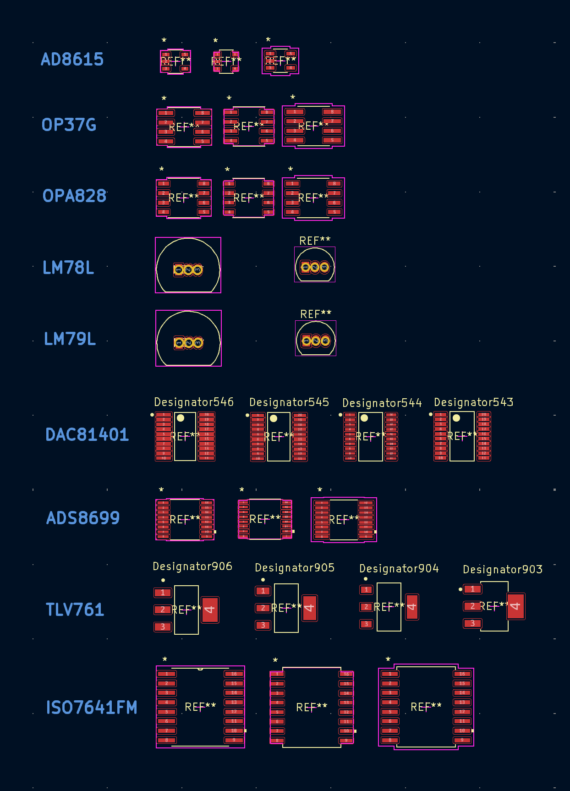
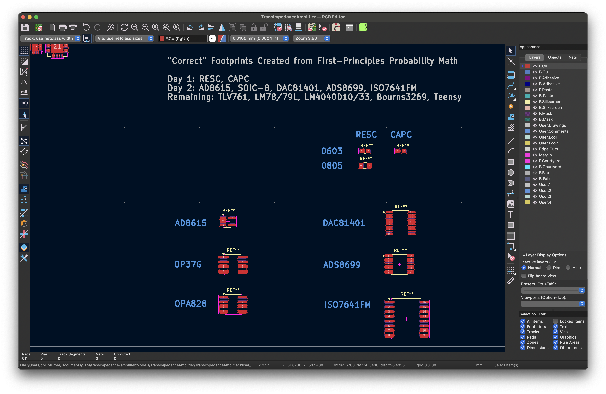
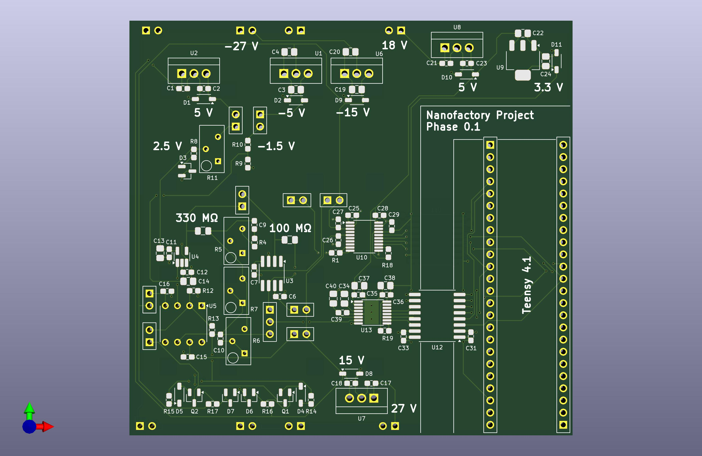
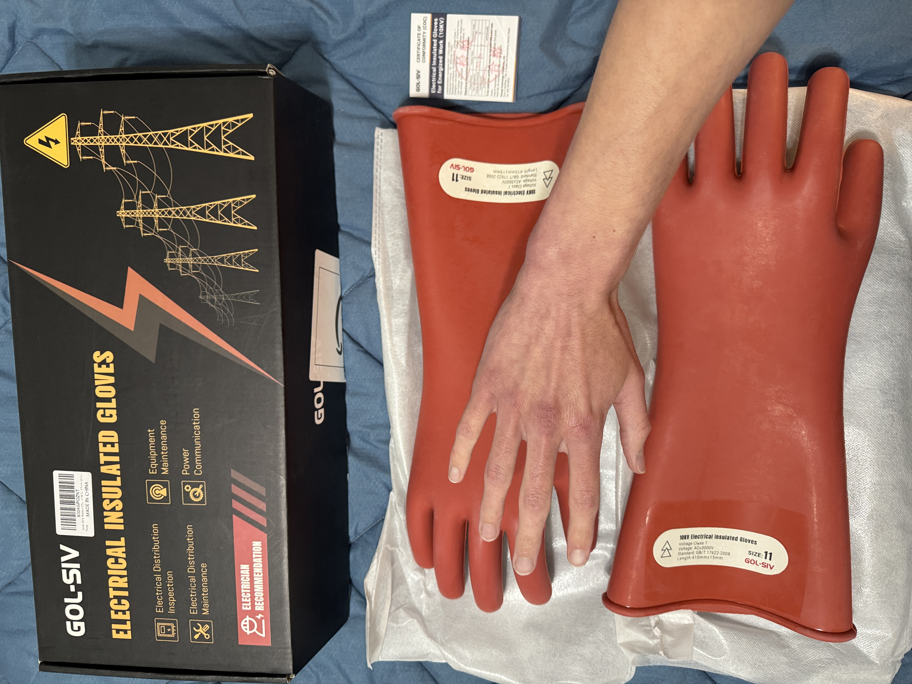
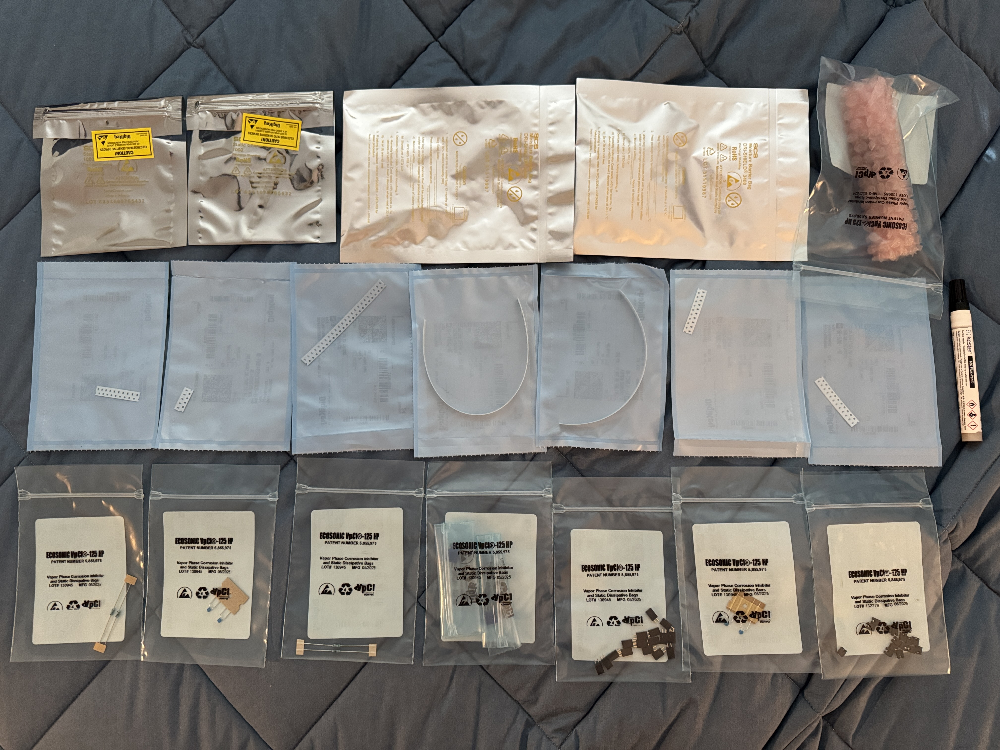
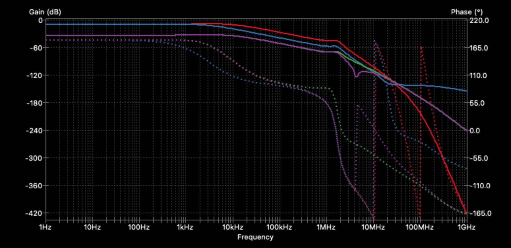

# Transimpedance Amplifier

<p align="center">
&nbsp;
  
&nbsp;&nbsp;
  
&nbsp;&nbsp;
  
&nbsp;
</p>

Phase 0.1 of the [APM Roadmap](https://github.com/philipturner/apm-roadmap)

Objective: Gather as much data as possible about the TIA sensor of an STM, using both theory and experiment.

Deadline: September 30, 2025 for the first physical prototype

Table of Contents:
- [July 26, 2025](#july-26-2025)
- [July 27, 2025](#july-27-2025)
- [July 28, 2025](#july-28-2025)
- [July 29, 2025](#july-29-2025)
- [August 3, 2025](#august-3-2025)
- [August 4, 2025](#august-4-2025)
- [August 5, 2025](#august-5-2025)
- [August 6, 2025](#august-6-2025)
- [August 7, 2025](#august-7-2025)
- [August 8, 2025](#august-8-2025)
- [August 9, 2025](#august-9-2025)
- [August 16, 2025](#august-16-2025)
- [August 18, 2025](#august-18-2025)
- [August 20, 2025](#august-20-2025)
- [August 22, 2025](#august-22-2025)
- [August 23, 2025](#august-23-2025)
- [August 26, 2025](#august-26-2025)
- [August 27, 2025](#august-27-2025)
- [August 28, 2025](#august-28-2025)
- [August 29, 2025](#august-29-2025)
- [September 1, 2025](#september-1-2025)
- [September 7, 2025](#september-7-2025)
- [September 8, 2025](#september-8-2025)
- [September 9, 2025](#september-9-2025)
- [September 10, 2025](#september-10-2025)
- [September 11, 2025](#september-11-2025)
- [September 12, 2025](#september-12-2025)
- [September 15, 2025](#september-15-2025)
- [September 16, 2025](#september-16-2025)
- [September 17, 2025](#september-17-2025)
- [September 18, 2025](#september-18-2025)
- [September 19, 2025](#september-19-2025)
- [September 20, 2025](#september-20-2025)
- [September 21, 2025](#september-21-2025)
- [September 22, 2025](#september-22-2025)
- [September 23, 2025](#september-23-2025)
- [September 24, 2025](#september-24-2025)
- [September 25, 2025](#september-25-2025)
- [October 22, 2025](#october-22-2025)
- [October 23, 2025](#october-23-2025)
- [October 24, 2025](#october-24-2025)

## July 26, 2025

Three simulation tasks, in chronological order
1) Understand/simulate why coarse tip approach takes so long
    - Understand specific algorithms for moving the coarse motor (approach & retract) without frictional backlash causing a tip crash
    - Understand maximum speeds of piezo motors
2) Simulate imperfect DAC-driven cancellation with a fixed value compensation capacitor
    - Use the tip-sample capacitance of a plausible geometry, derived with FEA
    - Include a finite insulation resistance
3) Fully understand the art of cabling analog lines in/out of UHV chambers + instrumentation amplifiers + ground loops
    - Include EMI and digital coupling from the bias DAC + ADC + SPI ports + power supply system

Notes about simulations:
- Make compromises to reduce the number of variables in each simulation, making it practical to set up
    - The simulations are not particularly computationally intensive, often 1-variable analytical functions, Fourier transforms, and integrals of power spectral density.
    - Likely using a combination of Google Sheets and single-file scripts hosted on GitHub Gist, hyperlinked to this repo.
- Exploit recently acquired skills in finite element analysis and the theory of EMI/grounding/shielding
- <b>Early IRL hardware tests may fail some requirements for system performance</b>, which are assumed or optimized for in the simulations

---

Simultaneously performing a low-cost physical test with a badly shielded IRL model
- Gather as much data, as early as possible
- Pipeline the phases of design elaboration
- Later stages include electromagnetic shielding, interfaces with automated electronics for the I/O voltages, then the logical transition to Phase 0.2

Primary blockers to first physical prototype:
- Lack of understanding about electrical performance of reversible DUT connection point (DUT = resistor, capacitor)
- Need to elaborate on requirements for ventilation from acid fumes, and other specific equipment to order for hand soldering
- Need to resolve the issues with incorrect/unnecessary bypass/decoupling capacitors
  - It is a very bad idea to omit all the capacitors, without at least giving it some rigorous consideration
- Need to resolve the missing/incorrect KiCad symbols and footprints for each IC. Organize the footprints on a physical PCB model and become familiar with the specific pin functions & positions.
- Need to clarify the bothersome trace width variable

<b>Fast-track work on the physical prototype.</b> Ensure that all fabrication equipment, testing equipment, and circuit parts are delivered by August 12, 2025. In any leftover time until August 12, I can return to the three simulation tasks.

An appropriate name for this is ["STM Experiment #3"](https://www.youtube.com/watch?v=IUPDecnuzO4). The experiments may not logically build on each other. For example, a single 1000 V linear amplifier doesn't logically follow a capacitive displacement sensor. However, it can still be catalogued as `n + 1` to show the iterative nature of design elaboration & exploration.

## July 27, 2025

One of the most important tests should be feedback loop stability. With the SPICE simulations, I can predict what values for input capacitance will send the circuit into oscillations. Pick a conservative value(s) for a capacitor DUT that satisfies this condition, without making the current exceed its dynamic range (simply reduce the frequency of the signal).

The first prototype will test two TIA variants. The first will be the standard OPA627 + 100 MΩ design used in most DIY STM projects. This will give a baseline for tracing failures, if the complex 2-stage design does not work at all.

I should see whether testing equipment, such as a handheld oscilloscope, can generate an input function. This would remove the need for a hard-coded triangle wave generator on the PCB. However, I might include the triangle wave generator anyway, for completeness and/or more debugging options. It also provides experience designing with digital/nonlinear components (comparator & Schmitt trigger), which may couple into the analog components against my wishes. There should be a simple way to disconnect the generator from power pins. It could be helpful to make the generator's capacitor swappable, so the frequency can change.

## July 28, 2025

I am starting to read large swaths of the IPC 7351 standard, February 2005 revision. This project will resolve my frustration with non-standardization of resistor & capacitor footprints. It substantiates a growing realization across many engineering projects, that complex systems have many variables. They demand significant amounts of data to wrap my head around. I am not satisfied with arbitrary guesses and binary yes/no "it worked" tests, with no explanation of how this choice contributed to a reduction in UHV chamber cost.

> My objective is obtain better control over the usability, performance, and cost of my end product(s).

I feel more comfortable creating my own footprints from scratch, where I can trust every parameter used to derive every dimension. I will compare my footprints to those from vendors, SnapEDA, and KiCad libraries.

## July 29, 2025

A few more things I want to do, before the 1st prototype:
- Run a SPICE simulation of the stability of a feedback loop with OPA627 + 100 MΩ. Check the limits of stability with the parasitic capacitance of the resistor.
  - Include a model of OPA637 to understand why that's not okay.
  - If OPA637 passes in the simulations, the test board will include a third TIA, OPA637 + 100 MΩ + no parallel capacitor.
    - Even if it doesn't pass, include the actual combination IRL, to prove that it oscillates when tested!
    - Unless this could plausibly impair the operation of the other amplifiers, and there's no way to switch off power to the OPA637.
    - Will severe oscillation conditions cause damage to the component and/or its power supply?
- Get more rigorous calculations of the parasitics for the components, and of the potentiometers.
- Design custom footprints for the capacitors and trimpots as well, in the first step. I previously planned to just wrap my head around the ICs + large resistors first. Instead, I should get the entire system specified at the highest (symbolic) level, and elaborate on the physical layout once that's fixed.
  - Bypass/decoupling capacitors are intentionally omitted at this stage.
  - The exact resistor values for the AD8615 voltage divider are omitted at this stage. Also not worrying about whether the two polarities of the divider cross through the GND net.
- Calculate the expected noise (e.g. Johnson noise from resistors in 2nd stage), bandwidth of the oscilloscope ADC, and consider electromagnetic shielding.
  - Consider an artificial bandwidth limiter with a transfer function similar to the ADS8699. This probably requires another IC. Good practice in selecting arbitrary op-amps for real world situations of need.
  - Calculate the leakage current at the physical current input junction + corresponding reversible DUT port. Compare the leakage current to the noise floor.
- Prepare a list of through-hole DUT components. Elaborate on whether it's a single DUT port for all 2&ndash;3 amplifiers, or a separate port for each.

I just learned/remembered that OPA627 and OPA637 are very old and expensive (\~$30). I'll have to revise these plans, to use newer and cheaper chips like OPA828 (\~$7). Or scrap the entire concept of additional 1-stage amplifiers to save time, depending on motivation.

## August 3, 2025

This project is on track to blow far north of its time budget. I'll have to compromise.


Permitted:
- Delete the oscilloscope from the workflow (yay!)
- Read [MT-015](https://www.analog.com/media/en/training-seminars/tutorials/MT-015.pdf), [MT-017](https://www.analog.com/media/en/training-seminars/tutorials/MT-017.pdf), [MT-019](https://www.analog.com/media/en/training-seminars/tutorials/MT-019.pdf), [MT-021](https://www.analog.com/media/en/training-seminars/tutorials/MT-021.pdf), [MT-090](https://www.analog.com/media/en/training-seminars/tutorials/MT-090.pdf) to understand the chips I'm working with
- Make an entirely custom footprint for every electronic part

Disallowed:
- Run a simulation to understand whether quantization noise and time jitter makes capacitance compensation unviable, with my novel approach
- Use any chips that require reflow soldering
- The analog triangle wave generator from the fast low-noise TIA paper. We're already synthesizing arbitrary waveforms with the DAC, with adjustable frequencies.

The near-term deliverable will pair the Teensy with a single DAC channel (DAC81401) and a single ADC channel (ADS8699), with a nerfed system bandwidth of 15 kHz. I really wanted a higher frequency to debug the first step. Unfortunately, the 500 kHz chip, ADS86861W, requires reflow soldering. I'll defer contemplating the ramifications of this omission to a later date.

---

Comments on the previous journal entry:
- Johnson noise is comparable to e<sub>n</sub>C noise, at 15 kHz bandwidth + 2nd order rolloff.
  - 6σ noise from capacitance is <b>5.2 pA</b>, provided just the 9.2 pF input capacitance of the AD8615 (conservative estimate, summing the differential and common-mode capacitance)
  - 6σ noise from capacitance is <b>24.7 pA</b>, when moved outside the UHV chamber, adding 35 pF to the capacitance to model a coaxial cable
  - 6σ Johnson noise from a 100 MΩ resistor is <b>10.9 pA</b>
  - 6σ Johnson noise from a 300 MΩ resistor is <b>6.3 pA</b>
  - 6σ Johnson noise from a 1 GΩ resistor is <b>3.5 pA</b>
- The noise signal appears as ~1 mV at the ADC.
  - 1-stage with OPA828ID:
    - 15.0 pF
    - 100 MΩ
    - 6σ noise envelope is <b>1.2 mV</b>
  - 2-stage with AD8615:
    - 9.2 pF
    - 300 MΩ
    - 6σ noise envelope is <b>2.4 mV</b>
- Don't need to construct an artificial 15 kHz filter out of discrete components. I'm using the actual ADS8699 chip in the circuit board now.
- 15 kHz bandwidth is more than enough for the STM feedback loop. If anything, I would use digital filtering to reduce it to the single kHz range, reducing the 6σ current noise to ~1 pA.

Source: [Transimpedance Amplifier (Google Sheets)](https://docs.google.com/spreadsheets/d/1QVJOiaRJbdRXN7CXii3z91K5A64h3VmgLCsRjpDpIrQ/edit?usp=sharing)

## August 4, 2025

<p align="center">
&nbsp;
  
&nbsp;&nbsp;
  
&nbsp;
</p>

## August 5, 2025

It is becoming very clear that I want to run this simulation about capacitive displacement sensing.

The simulation will have an analytical (frequency domain) and numerical (time domain) part.
- Analytical stuff:
  - Theoretical model of the distribution of quantization noise among the DACs (evenly across the Nyquist bandwidth)
    - Ensure the sine wave frequency is indivisible by the quantization frequency (100 kSPS)
    - Concerned about the variable-voltage approach not being able to perfectly cancel the quantization noise
  - Model of the integrated e<sub>n</sub>C noise after lock-in amplification
  - Model of the transfer function for the 2-stage TIA, which might change with input capacitance (?)
- Numerical stuff:
  - FP64 for the simulations to avoid concerns about rounding error, over long time intervals for lock-in amplification
    - Time stepping resolution 1&ndash;2 orders of magnitude better than the 100 kSPS sampling rate
  - Exact algorithm for a digital filter approximating a first-order or second-order lowpass
    - Validate that the filters have the expected gain falloff, by running a sweep over sine wave frequencies
    - The filter is affected by the time step size
  - Simulate the two DACs being out of sync, which probably cannot be represented in an analytical frequency domain model
- A way to include the effects of shot noise from background capacitance into the results of the numerical part

Imperfections covered in the simulation:
- Inaccurate matching of a fixed-value capacitor to the tip-sample capacitance (up to a factor of 10 in either direction)
- Overloading the maximum TIA voltage due to the transfer function exceeding the ADC @ 15 kHz. Specifically, overloading from signals in the 15&ndash;30 kHz range.
- Quantization of the two DAC signals causing a strange division of the Gaussian quantization errors (?)
- The two DACs being out of sync (not yet figured out the exact amount of delay to test)

Imperfections not covered:
- Time jitter in the ADC and/or DACs
- Switching transients in the DACs
- Interference from acoustic noise
- Interference from a finite insulation resistance in the compensation capacitor

First step:
- Attempt to find a formula for the RMS current of two cancelling signals, slightly phase shifted
- Address the low-hanging fruit, of a frequency domain analysis of the effect of quantization noise

Second step:
- Refresh myself on the analytical formulas for transfer function of the fast low-noise TIA, stability conditions, and location of the 2nd pole
- Figure out the exact potentiometer values appropriate for this circuit
- For simplicity (to save time), the simulation will assume the potentiometers are perfectly matched, to an infinite resolution

Since I am in the car right now, I cannot work on the first step. Therefore, I will proceed with specifying the near-term experiment with reduced scope.

---

Interesting observations:
- ADS8681W is not even in stock, although Mouser expects a new batch in late August
- Only Mouser has stock of DAC81402, DigiKey does not
- Amazon Basics 6LR61 is probably sufficient for the 9V batteries

## August 6, 2025

I understand how the AH2550 / AH2700 works now. Used this knowledge to understand possible limitations in my custom metrology setup.


[Capacitive Displacement Sensing (Google Sheets)](https://docs.google.com/spreadsheets/d/1fhiZoWPt_2P-jLdGjmx1e9VDYEp9JpBjLP0ZZkT_46Y/edit?usp=sharing)

Done with the investigation of capacitive displacement sensing. Modulation voltage is 10 V, carrier frequency is 10 kHz. Pushing the limits of the DAC and ADC. Digitization rate in the DAC assumed 50 kSPS to give a conservative estimate for quantization noise.

Assuming the two capacitances can be compensated to 99.9% accuracy, static magnitude and shot noise of the background signal are not limiting factors. The ratio of 1 LSB in the ADC to the static background signal (~565 pA) is 1:1800.

Dominant issue is dynamic quantization noise. In the AH2550/AH2700, the quantization errors from the two stimulus signals (near-)perfectly cancel. In my design, they do not.

## August 7, 2025

I did some work on the voltage limiter for the 2nd stage of the 2-part TIA. I went with copying the part models from the latest iteration of the design by Schmid et al. There is an extremely large space of manufacturers and part variants, for diodes and BJTs that are almost the same.

I was about to inspect more details of these parts, and the conditions they're subjected to, to understand more about what's going on. Instead, I deferred that task to a later date. Just as elaboration on the specific decoupling network for each IC, is out of scope for today. Except for the fact that AD8615's decoupling network uses a 1 kΩ potentiometer and a 3.3V Zener.

Thanks to Michael Schmid for filling me in on the recommended decoupling network, thus saving a lot of time. Chips like the ADC and DAC, or other parts where decoupling is critical to operation, typically have a manufacturer's suggested configuration on the datasheet.

[Discrete Semiconductors (Google Sheets)](https://docs.google.com/spreadsheets/d/1FA-BcQ8bDqJqKHbvW08lza3Lz3hW-CrOkspl6eD3IWo/edit?usp=sharing)

I am returning to the KiCad project, currently in the stage of specifying the symbolic schematic. I've specifically declared PCB geometry and footprints out of scope. When downloading part symbols from vendor websites, I neglect the footprints and 3D models. However, I'm aware of the specific package. For example, I chose the THT package over the SMT package for the voltage regulators. Although the part becomes larger, the pin count reduces from 8 to 3; the pin mapping is more direct. Everywhere else, I prefer an SMT package if possible.

I will rename the hierarchical sheets for the transimpedance amplifiers, avoiding words that start with a number. I will also attempt to create a deeper level of hierarchy for the 2 stages of the 2-part TIA. Then, I will copy as many part symbols as possible, for everything except small resistors, small capacitors, and reversible connection ports.

Tomorrow, I should be able to start specifying in/out lines for each module. For example, distributing regulated voltages from the power module to each client module. The low-frequency decoupling capacitor and voltage divider for the AD8615's ±5 V lines will probably be encapsulated within the sub-sheet of the 2-stage TIA. All other regulators have their networks specified in the power module.

> A deep investigation is warranted for the subtle detail of a 0.01 μF C2 on the LM78L datasheet / 0.1 μF on LM79L. Approaching the severity of declaring all footprints for every circuit part "custom" to achieve control of the little details. Again, beyond the scope of the tasks outlined above.

## August 8, 2025

Today, my objective was to understand more about the parasitic capacitance of the TIA feedback resistor.


_Cross-section view of the Elmer simulation results, showing where the electrostatic energy is concentrated. The sharp ends of the conductors contain 90% of the energy associated with capacitance._

I created a multi-material model of the Vishay 0805 <b>thick film</b> chip resistor. Each conductor is 10	μm thick and wraps around from top to bottom. The bulk of the component is a slab of alumina, parameterized with ε<sub>r</sub> = 9.1. The resistive element was replaced with air. After several hours of troubleshooting, I got the simulation to work. The initial result, ~40 fF, was unexpectedly small. I tried refining the mesh, to see whether the result would change.

| Node Count | Element Order | Mutual Capacitance (C<sub>12</sub>) |
| ---------: | ------------: | ----------------------------------: |
| ~5,000     | 1             | 39.61 fF                            |
| ~14,000    | 1             | 37.83 fF                            |
| ~40,000    | 1             | 36.93 fF                            |
| ~150,000   | 1             | 36.46 fF                            |

In his [ultra-low noise qPlus AFM sensor design](https://doi.org/10.1063/1.4993737), Geissibl used an 0805 <b>thick film</b> chip resistor ([datasheet](https://www.te.com/usa-en/product-1625862-1.datasheet.pdf)). He reported 150 fF, which agrees with the generally\* assumed 100 fF for transimpedance amplifiers. I simulated an almost identical geometry, and was off by a factor of 4.

> \*Art of Electronics, fast low-noise TIA paper

Vishay [measured the parasitics](https://www.vishay.com/docs/60107/freqresp.pdf) of <b>thin film</b> chip resistors, going as large as 0603. The capacitances follow a predictable scaling law. I'll develop a model that accepts any resistor geometry, and matches them to the Vishay data.

| Source           | Case Size | L    | W    | H    | T2   |
| ---------------- | --------- | ---: | ---: | ---: | ---: |
| Vishay (2009)    | 0201      | 0.51 | 0.25 | n/a  | 0.20 |
| Vishay (2009)    | 0402      | 1.02 | 0.51 | n/a  | 0.29 |
| Vishay (2009)    | 0603      | 1.63 | 0.81 | n/a  | 0.49 |
| Vishay D/CRCW e3 | 0402      | 1.00 | 0.50 | 0.35 | 0.20 |
| Vishay D/CRCW e3 | 0603      | 1.55 | 0.85 | 0.45 | 0.30 |
| Vishay D/CRCW e3 | 0805      | 2.00 | 1.25 | 0.50 | 0.30 |
| TE               | 0805      | 2.00 | 1.20 | 0.40 | 0.30 |

_Part dimensions from three literature sources. All dimensions are in millimeters._

Use thick film 0603 as an "origin" or normalized value, from which other capacitances are scaled. It is the case size I will use in the PCB. Scaling behavior comes mostly from lengthening and separating the sharp ends of the conductors. Scaling of height could both increase and decrease capacitance, making it troublesome to model. Therefore, we don't need to worry about the lack of height data for Vishay (2009).

I developed two fittings of the data ([source](https://docs.google.com/spreadsheets/d/1QVJOiaRJbdRXN7CXii3z91K5A64h3VmgLCsRjpDpIrQ/edit?usp=sharing)). One extrapolates based on the parallel plate model. The other extrapolates based on the parallel wire model. Here are the final values for capacitance, after correcting for the discrepancy between "flip chip" and "wrap around".

| Source           | Case Size | parallel plate | parallel wire |
| ---------------- | --------- | ---: | ---: |
| Vishay (2009)    | 0201      | 33.9	fF | 28.2	fF |
| Vishay (2009)    | 0402      | 35.3	fF | 41.0 fF |
| Vishay (2009)    | 0603      | 60.3	fF | 60.3 fF |
| Vishay D/CRCW e3 | 0402      | 24.9	fF | 37.8 fF |
| Vishay D/CRCW e3 | 0603      | 45.4	fF | 59.0 fF |
| Vishay D/CRCW e3 | 0805      | 66.7	fF | 81.1 fF |
| TE               | 0805      | 61.4	fF | 77.9 fF |

The Vishay data predicts ~74 fF, double the simulation result.

<b>Option 1:</b> Continue trying things in the simulator, to raise the lower bound for capacitance with an 0603 case size. This single parasitic value is the reason for the entire 2nd stage of the TIA. If the cutoff frequency is ~13 kHz, the ADS8699 cannot facilitate tuning.

<b>Option 2:</b> Switch to the larger 0805 size, which will certainly have more capacitance than 0603 and match previous expectations.

Conclusion: Go with option 2, reworking the equations to handle an unknown value in the range of 74&ndash;250 fF. If this makes the design unworkable, revert to option 1. Accept reduced tunability at a tradeoff of faster time to completion. If the range of 74&ndash;150 fF is more tunable than 150&ndash;250 fF, this is very good.

> Realization: Simulation work will only raise the lower bound to capacitance. Marginal improvements to the lower bound will cost disproportionately more effort. There is no upper bound. Poor PCB design will add parasitic coupling to the lower bound.
>
> C<sub>f</sub> &ge; 74 fF
>
> The primary goal here is to maximize the lower bound, to avoid a situation where the first cutoff frequency is under 15 kHz. The secondary goal is to maximize tunability, by restricting the range of uncertainty.

---

Tracking the cutoff frequency throughout this investigation:

| R<sub>f</sub> | C<sub>f</sub> | f<sub>c</sub> | Case Size |
| ------------: | ------------: | ------------: | --------- |
| 100 MΩ | 100 fF | 15.9 kHz | n/a |
|   1 GΩ | 100 fF |  1.6 kHz | n/a |
| 300 MΩ | 100 fF |  5.3 kHz | 0603 |
| 300 MΩ |  40 fF | 13.2 kHz | 0805 |
| 300 MΩ |  30 fF | 17.7 kHz | 0603 |
| 300 MΩ |  52 fF | 10.2 kHz | 0603 |
| 300 MΩ |  74 fF |  7.2 kHz | 0805 |
| 330 MΩ |  74 fF |  6.5 kHz | 0805 |

330 MΩ exists in both 0805 and 0603 sizes. 300 MΩ is exclusive to 0603. I will revise the symbolic schematic to use 330 MΩ, 5% in the 0805 size, with the respective purchase link on DigiKey.

## August 9, 2025

I decided to try a few more FEM simulations, and immediately found a surprising result.

| Node Count | Region 1 | Region 2 | Region 3 | C<sub>12</sub> |
| ---------: | -------: | -------: | -------: | -------------: |
| 7963       | 1.000 mm | 0.150 mm | 0.050 mm | 163.39 fF      |
| 19741      | 0.667 mm | 0.100 mm | 0.033 mm | 153.63 fF      |
| 72073      | 0.400 mm | 0.060 mm | 0.020 mm | 146.14 fF      |

Adding a ground plane on the opposite side of the 2-layer PCB:

| Node Count | C<sub>12</sub> | C<sub>13</sub> | C<sub>23</sub> |
| ---------: | -------------: | -------------: | -------------: |
| 17143      | 60.44 fF       | 170.51 fF      | 169.94 fF      |
| 45255      | 58.25 fF       | 165.37 fF      | 165.21 fF      |
| 169417     | 56.04 fF       | 161.22 fF      | 161.29 fF      |

The literature advises against placing a ground plane directly underneath the resistor. Changing the ground plane to a ring:

| Node Count | C<sub>12</sub> | C<sub>13</sub> | C<sub>23</sub> |
| ---------: | -------------: | -------------: | -------------: |
| 15255      | 72.29 fF       | 131.96 fF      | 131.47 fF      |
| 40545      | 70.27 fF       | 126.24 fF      | 126.52 fF      |
| 155345     | 67.65 fF       | 121.74 fF      | 122.10 fF      |

I'm screenshotting E-field intensity instead of electrostatic energy density now. The latter is proportional to the former, just squared. This choice makes it easier to see important details without calibrating the color legend.

<p align="center">
&nbsp;
  
&nbsp;&nbsp;
  
&nbsp;
</p>

_Exact same setup as yesterday, but with more conductor material and a dielectric slab underneath._

<p align="center">
&nbsp;
  
&nbsp;&nbsp;
  
&nbsp;
</p>

_Filling the opposite side of the dielectric with a conductor. The 250 μm via makes the next simulation easier to set up._

<p align="center">
&nbsp;
  
&nbsp;&nbsp;
  
&nbsp;
</p>

_Changing the plane to a ring. Outer dimension measures 5 mm, ring thickness is 500 μm._

### Summarizing Today's Data

| Ground Coupling Severity        | C<sub>12</sub> | C<sub>12</sub> \|\| C<sub>23</sub> | C<sub>12</sub> \|\| (C<sub>13</sub> series C<sub>23</sub>) |
| ------------------------------- | --------: | --------: | --------: |
| None                            | 146.14 fF | n/a       | n/a       |
| Poorly designed keepout zone    | 67.65 fF  | 189.75 fF | 128.61 fF |
| Complete overlap with GND plane | 56.04 fF  | 217.33 fF | 136.67 fF |

Once the PCB layout is finalized, I'll run another FEM simulation of the ground conductor geometry. I'll make sure C<sub>12</sub> exceeds 80\* fF. This is a slight improvement over 74 fF, instead of a major degradation to 67 fF. The average (expected) value to target is 150 fF. The upper bound is somewhere between 200&ndash;300 fF, based on my discretion.

> \*Expect this condition to be met after draconian measures to isolate the resistor.

Continuing the FEM simulations for another day was a good choice. I am now more confident in the numbers stated in the literature. I can proceed with more certainty about expected performance and less extreme design margins.

## August 16, 2025

The August 31 deadline seems unrealistic now, but it was a good motivator to get me working again. I'm proceeding at the correct pace to achieve the end goal. Every day, I resolve a different unknown variable and the hardware design becomes more specific.

I'm using basic linear algebra to study the 5 coupled variables for component values in the TIA compensation network: [TransimpedanceAmplifierCalibration.swift](https://gist.github.com/philipturner/219ffce07112c4575081fc9615dd2323)

## August 18, 2025


Common properties of KiCad default footprints:
- 0.20 mm keepout zone around copper pads (thin red line)
- 0.25 mm distance between courtyard and copper/part outline
- 0.10 mm line width in F.Fab for part outline
- 0.12 mm line width in silkscreen layer for fiducial outline
- 0.11 mm distance between centers of lines for F.Fab and silkscreen
- 0.15 mm text thickness
- 1.00 mm text height
- 1.00 mm text width

Do the official vendor footprints (Texas Instruments, Analog Devices) match these conventions?



Observations:
- The text size is exactly 0.15 mm, 1.00 mm, 1.00 mm. I wonder whether this is an industry standard or just something KiCad sets.
- 0.20 mm thin red line around copper pads exists for all footprints. I wonder whether this is something KiCad sets.
- Line width in F.Fab varies, either ~0.03 mm (could be 1 mil) or 0.15 mm.
- Line width in silkscreen layer is 0.15 mm.
- Distance between F.Fab and silkscreen is impossible to predict.
- Distance between F.Fab and courtyard varies wildly. For some products, the three footprints differ in the courtyard being 0.10 mm, 0.25 mm, or 0.50 mm. For some other products, there is no courtyard at all!

I will examine how much the dimensional tolerances vary, across ICs with identical packages. Then, I will make custom footprints for RESC and CAPC from scratch. I will decide how to approach the numerous specific chips once I have the data stated previously.

---

I decided on the following physical dimensions for the landing pads.

| Part      | Pitch   | Z        | G       | X       |
| --------- | ------: | -------: | ------: | ------: |
| CAPC0603  | n/a     | 2.88 mm  | 0.56 mm | 1.08 mm |
| RESC0603  | n/a     | 2.85 mm  | 0.56 mm | 1.13 mm |
| RESC0805  | n/a     | 3.36 mm  | 0.97 mm | 1.56 mm |
| AD8615    | 0.95 mm | 4.19 mm  | 0.82 mm | 0.69 mm |
| OP37G     | 1.27 mm | 7.35 mm  | 2.74 mm | 0.69 mm |
| OPA828    | 1.27 mm | 7.35 mm  | 2.74 mm | 0.69 mm |
| DAC81401  | 0.65 mm | 7.75 mm  | 4.16 mm | 0.44 mm |
| ADS8699   | 0.65 mm | 7.75 mm  | 4.16 mm | 0.44 mm |
| ISO7641FM | 1.27 mm | 11.76 mm | 6.92 mm | 0.69 mm |

## August 20, 2025



## August 22, 2025

Deliverables for today:
- Organize the footprint libraries into: TwoTerminal, ThreeTerminal, IC, ThroughHole
- Collect more purchase links and elaborate on more IC local decoupling networks.
  - Start with finalizing the trimpot variant.
  - Then, the discrete semiconductors.
  - Finally, the 0805 capacitors with tight dimensional tolerance.
- If possible, finalize the Schottky diode model as well. See whether all diode models can share a common footprint:
  - 1N4448W
  - LM4040D10
  - LM4040D33
  - Chosen Schottky diode model

I did not get through all the deliverables today. I was looking for a purchase link for LM79L15, and realized the TO-92-3 version was not in stock. To sort through options for alternative products, I tabulated the total current load at every regulator. The LM78L15 and LM79L15 have ~45 mA, which is below the rated 100 mA. However, the power dissipation is ~0.6 W, almost at the limit of safe operating area. These chips would be elevated 100°C above ambient temperature!

I decided to switch the 15 V, -15 V, and 5 V (Converter) lines to the higher-current versions, in a TO-220 package. This should reduce the temperature rise by a factor of 2.6&ndash;4, and put the wattage far below the rated limit. I will download fresh symbols from the manufacturer and update the schematic accordingly.

I may switch the PreAmp's power supplies over to TO-220 as well, for convenience. This choice reduces the time spent on footprint design. We're already using through-hole components, either way.

---

I also want to switch to the Bourns 3296 model, which is through-hole. It feels more comforting, knowing that the mechanical bond to the PCB is stronger. It also isn't significantly larger on the thickness dimension (4.8 mm vs 4.3 mm for SMT version).

This choice makes life a little bit easier. The footprints are through-hole, and thus probably easier to design. They also sit at the cost minimum compared to the SMT version.

| Model | Cost (Average) |
| ----- | -------------: |
| 3269W | $4.26          |
| 3296W | $2.36          |
| 3296Y | $2.16          |

## August 23, 2025

Many great developments today. I found a decoupling network for every IC that I agree with. I overhauled all the bypass capacitors, to a simple set of 3 capacitor values (100 nF, 1 μF, 10 μF). Boosted confidence that I can start fabricating the physical prototype close to the original August 31 deadline.

TODO list for the rest of today:
- Purchase links for regulators
- Purchase links for new trimpots (Y variant)
- Footprints for 0805 capacitors
- Purchase links for Schottky diodes
- Finalize all decoupling networks

## August 26, 2025

Next steps: figure out the footprints for linear regulators, potentiometers, and Teensy 4.1.

Reminded myself that I can just use jumper wires for the reversible connections between TIAs and the ADC. Less complex than a mechanical switch, and more flexible. For example, I can have both amplifiers disconnected from the ADC, so it directly senses the DAC output. Might also minimize some parasitics (capacitance, insulation resistance) of a switch on the current input to a TIA.


I decided on Sullins Connector Solutions as the vendor for pin headers, pin sockets, and jumpers.

## August 27, 2025


This arrangement doesn't work. The connectors don't fit across the dimension of two separate batteries.

To make everything easier, we'll try a separate approach. Each of the 9 V batteries has a dedicated +/- connector. This connector is soldered directly onto the PCB. It costs slightly more than the battery itself, but saves a lot of design effort and space.


In KiCad, I'll use an isolated battery (not connected terminal-to-terminal with neighbors) to represent the connector. It would already be strange to specify the battery purchase link separately, as I'm getting all 8 in a single pack. Instead, each symbol will use the purchase link for the connector. There will be an additional dedicated footprint for this connector.

## August 28, 2025

I stumbled upon a very important insight for the PCB layout phase: [Source](https://www.eevblog.com/forum/kicad/connecting-two-nets/msg5608951/#msg5608951)

> I agree that the ratsnest does not help you match a specific capacitor to a specific pin on a specific part before you have the components placed the way you want them. I usually get capacitors at least close to the right component without specific effort because during initial component placement I'm in the habit of <b>drag-selecting groups of related components in the schematic</b> in order to get them selected in the schematic, and then using "Pack and Move Components" (should be mapped to the "P" hotkey) in the PCB to group them together. I usually stick each related group by itself somewhere off-board to see how it connects to other groups, and then <b>start moving entire unrouted and randomly arranged groups</b> to begin figuring out my placement strategy. Once I begin placing individual components within a group, the group at least contains the right capacitors (and only the right capacitors) for the IC(s) in that group. This will be less cumbersome if you have enough screen space to have the schematic and PCB tools open side by side.

## August 29, 2025


I can strategically place the two modules, to evenly distribute battery weight across the board. This makes it more mechanically / gravitationally stable, improving ease of use. I could even place them underneath, turning the batteries into the mechanical supports for the board. This choice would leave more room on the top for visually debuggable components.


_Arrangement to stop the USB cord from sagging and yanking the PCB off the table._

Interesting links and ideas for future reference:
- https://www.matsusada.com/product/matrix/high-voltage-amplifiers.html
- https://www.mouser.com/c/semiconductors/amplifier-ics/operational-amplifiers-op-amps/?m=Apex%20Microtechnology&supply%20voltage%20-%20max=900%20V~~1.25%20kV&instock=y&sort=pricing&rp=semiconductors%2Famplifier-ics%2Foperational-amplifiers-op-amps%7C~Supply%20Voltage%20-%20Max
- Using a DC-DC switching converter as the 1st stage in a series of filters for the power supply

## September 1, 2025



## September 7, 2025

Things are not looking good. I am having an argument about who is going to fund the bill of materials, and its implications for my wider financial security. I was going to purchase everything today, but things just went off schedule.

There is a good chance I will purchase everything out of pocket. DIY projects don't really need crowdfunding; they're the scale of money accessible to any average person. It's the big things like getting a salary so you can spend 100% of your time working on something, that requires serious and secure funding. I started reading the Wikipedia series on [corporate law](https://en.wikipedia.org/wiki/Corporate_law).

On the hobby side, I am feeling burnt out on Minecraft. I might be gravitating back toward the hobby of Swift programming for "nanotech CAD", which is just for personal enjoyment and not financial stability.

## September 8, 2025

I am going to order all equipment today, out of pocket. Previously, I used a crowd-funding/group-funding approach, where 2-3 people split the bill for an order of ~$100. Looks like that approach no longer scales when I need $800 purchases on a timely deadline. That's where you benefit from liquid funds you have direct control over, in your own bank account. Money buys time.

[Bill of Materials (Google Sheets)](https://docs.google.com/spreadsheets/d/1QVJOiaRJbdRXN7CXii3z91K5A64h3VmgLCsRjpDpIrQ/edit?gid=1651612763#gid=1651612763)


I will be reimbursed for all of this, and receive back pay for the person hours spent on the Transimpedance Amplifier project, once I have financial stability. I will never resort to working part-time in unrelated jobs such as the AI field. I will always spend my time how I see fit, for my own priorities, on nobody else's schedule. Real world hardware is what gets serious funding.

### Confirmation Emails


### OSH Park Invoice

<p align="center">
&nbsp;
  
&nbsp;&nbsp;
  
&nbsp;
</p>

### DigiKey Invoice

| Page | Screenshot |
| ---: | ---------- |
| 1    |  |
| 2    |  |
| 3    |  |
| 4    |  |
| 5    |  |
| 6    |  |
| 7    |  |
| 8    |  |
| 9    |  |
| 10   |  |

### Amazon Invoice

<p align="center">
&nbsp;
  
&nbsp;&nbsp;
  
&nbsp;
</p>

## September 9, 2025

I just had a brilliant idea, and was very delighted by it. However, I think it's best to continue my break from the hardware stuff. It's bad for my state of mind, to suddenly switch contexts like this. Whether the system eigenfrequency is sufficient, is one of many make-or-break unknowns.

Setting up an FEM simulation in FreeCAD of Phase IV system eigenfrequency
- Worst-case option needing 500 nm range on all coarse axes, and the fine Z axis
- 2 kinematic mounts stacked on top of each other for X and Y
- Unable to recycle coarse axes as fine axes
- Put this in the transimpedance-amplifier repo for convenience

On the other hand, perhaps I can simplify the system geometry to make the simulation more accessible. The nanoasperities of the kinematic mounts should not be explicitly modeled. I don't know what their effect is on the ultimate result, but there are probably more important big ideas. I think I can finish this entire simulation tonight.

| Material | Young's Modulus | Density | Speed of Sound |
| -------- | --------------: | ------: | -------------: |
| Lithium Niobate | 181&ndash;202 GPa | 4.64 g/mL | 6250&ndash;6560 m/s |
| Steel           | 190-210 GPa | 7.75-8.05 g/mL | 4950&ndash;5110 m/s |
| Aluminum Oxide  | 370-400 GPa | 3.99 g/mL | 9630&ndash;10010 m/s |
| Aluminum        | 69-70 GPa | 2.70 g/mL | 5060&ndash;5090 m/s |
| Epoxy           | 3&ndash;30 GPa | 1.1&ndash;1.43 g/mL | 1650&ndash;4580 m/s |
| Copper          | 110-128 GPa | 8.96 g/mL | 3500&ndash;3800 m/s |

It might be valid to just use the material parameters for aluminum, which I used in previous eigenfrequency simulations. Not messing with multi-material FEM simulations, which are a pain to set up and seem to break the FEM simulator for eigenfrequency.

I am using the Aluminum-Generic default in FreeCAD, which sets the Young's modulus to 70 GPa.

<p align="center">
&nbsp;
  
&nbsp;&nbsp;
  
&nbsp;
</p>

_Render of the 1st eigenmode with constraints included (6.9 kHz). The mesh has 33,190 nodes and 18,521 volumes. The entire assembly measures 65 x 50 x 100 mm._

Without any constraints:

| Eigenmode Number | Frequency |
| :--------------: | --------: |
| 1                | 3340 Hz   |
| 2                | 5231 Hz   |
| 3                | 7086 Hz   |

With the supporting outer surfaces constrained, as in real life:

| Eigenmode Number | Frequency |
| :--------------: | --------: |
| 1                | 6901 Hz   |
| 2                | 8025 Hz   |
| 3                | 11528 Hz  |

Eigenfrequency of a solid cube with the assembly's XYZ dimensions:

| Cube Side Length | Stiffness | Mass | Frequency |
| ---------------: | --------: | ---: | --------: |
| 0.065 m  | 4.55 GN/m | 0.741 kg | 12471 Hz |
| 0.050 m  | 3.50 GN/m | 0.338 kg | 16196 Hz |
| 0.100 m  | 7.00 GN/m | 2.700 kg |  8104 Hz |

## September 10, 2025

I forgot to order high-voltage insulated gloves. I am treating this project like a Phase I&ndash;II system, with regular exposure to ~1000 VDC. The official Class 0 with 1000 VAC / 1500 VDC seems sufficient. The next rank, Class 1, goes all the way to 7500 V, probably with proportionally greater thickness. It is critical to minimize thickness, because I need the dexterity to work with my equipment.

I chose a reputable vendor on Amazon, who specializes in manufacturing PPE. Their product lineup included two contenders, 3000 V and 8000 V rated, both called "Class 1". I chose the 3000 V option because it's enough for Phase II. However, Phase III and beyond will use an ion pump, which could reach 7000 V. I will worry about high-voltage dangers of the Phase III system in the distant future.


I retroactively included the high-voltage gloves in the BOM spreadsheet, under a "Late Purchases" category. I tabulated it as an "Amazon 2" order to simplify the accounting of different orders.

---

I read the datasheet for the Apex PA94 (900 V, 140 MHz) and the application note "General Operating Procedures". A first glance at the safe operating area has us worried, with 21 W quiescent power dissipation possibly overheating the device. The application note highlights that this specific concern is false for the high-voltage, high-speed products like PA94. I can operate it at 900 V and low output current with no problems.

The amplifier requires a bipolar ±450 V supply, not a unipolar 900 V. This is because the two input pins cannot be more than 450 V away from either supply pin. So the old idea of having a GND line and a 900 V line, then multiplexing them to double the effective range, cannot work. There's still an option to have two Apex op amps per piezo actuator (one driving each set of alternating plates), but this defeats the whole point of the original idea. So we've resolved the unknown regarding whether piezo range can be doubled for free.

Assume a conservative 800 (±400) V to avoid exceeding absolute maximum ratings, as a result of component tolerances. We have now resolved several unknowns regarding the system mechanics:

| Actuator | Piezo Plates | Range | DAC INL Imprecision |
| -------- | -----------: | ----: | ------------------: |
| Coarse X | 3 x 10       | 544 nm | ±8 pm |
| Coarse Y | 3 x 10       | 544 nm | ±8 pm |
| Coarse Z | 3 x 10       | 544 nm | ±8 pm |
| Fine X   | 6            | 326 nm | ±5 pm |
| Fine Y   | 6            | 326 nm | ±5 pm |
| Fine Z   | 12           | 652 nm | ±10 pm |

If the coarse piezo can also perform fine motion without sliding or variation of nm/V calibration, we can eliminate the Fine X and Fine Y piezos in Phase IV. The Fine Z piezo would remain, to be conservative.

The plate count is 30/54/114 for Phase I/II/IV. Assuming the current price for 10 mm, X-cut plates from Crystal Substrates ($27.60 each), that is $828/1460/3146. But this number doesn't include spares needed for failed piezo stack fabrication attempts. We should employ modular, reversibly bondable design techniques to allow recycling of piezoactuators from partially broken complete systems. That will minimize the number of spares needed.

### Sensors

| Device | Type | Phase 0.2 | Phase I | Phase II | Phase IV |
| ------ | ---- | :-------: | :-----: | :------: | :------: |
| Coarse X | DAC output | | | | ✅ |
| Coarse Y | DAC output | | | | ✅ |
| Coarse Z | DAC output | | ✅ | ✅ | ✅ |
| Fine X   | DAC output | | | ✅ | TBD |
| Fine Y   | DAC output | | | ✅ | TBD |
| Fine Z   | DAC output | ✅ | | ✅ | ✅ |
| Bias     | DAC output | TBD | TBD | ✅ | ✅ |
| V<sub>comp</sub> calibration | MDAC | TBD | TBD | ✅ | TBD |
| Tunneling current | ADC input | TBD | TBD | ✅ | ✅ |
| AD7745            | I2C interface | TBD | TBD | | | |
| Michelson interferometer X | TBD | | | | ✅ |
| Michelson interferometer Y | TBD | | | | ✅ |
| Michelson interferometer Z | TBD | | | | ✅ |

In the DAC81404, the full-scale output range for each DAC channel is independently programmable. This avoids any constraint that the bias voltage might need to use a different DAC than the piezos. The piezo DACs use the ±20 V mode, amplifying with a 20 V/V gain factor to ±400 V. The bias uses the ±10 V mode.

The AD7745 must be reversibly bondable to the Islam-Beamish junction. It cannot be used simultaneously with the custom TIA-based capacitance sensor. It also cannot be fed into a UHV chamber (too much parasitic capacitance on the coaxial cables). It is mostly a test, like a simpler backup option. In much the same way as the 100 MΩ amplifier in Phase 0.1. There are still unknowns regarding the mechanical configuration of the compensation capacitor, especially with an Islam-Beamish junction. The custom capacitance sensor was designed for a standard STM tunneling junction, where the compensation capacitance may differ from the tip-sample capacitance by an order of magnitude. The AD7745 has a built-in compensation capacitance (7-bit CAPDAC) and thus may be more suited for an Islam-Beamish junction.

The custom capacitance sensor is a <b>substitute for the Z-axis Michelson interferometer</b> from Phase IV. It cannot detect the surface position on first-time tip approach. Instead, one must hope the cryogenic UHV chamber supports optical windows to perform coarse approach by eye. Assume this needs to be automated through computer vision (CCD camera) at some point. Rather, these coarse position readouts allow repeatable approach during hundreds of round trips after the 1st tip approach. They require pre-existing knowledge of the exact position where the tip contacts the surface. The X and Y interferometers mostly prevent accumulation of drift (dead reckoning errors) that could make the exact line separating two Si sample wafers unknown. There will be extreme stress on the reliability of the interferometers, to prevent a single 2-pi ambiguity error from happening over hour or day-long mechanosynthetic build sequences. I think the whole coarse nanopositioning system will be fast enough that the bottleneck is inverted mode tip registration.

The PA95 looks like a better choice than the PA94 for my application. An order of magnitude less quiescent current. It's still reasonably affordable ($283 vs $215) and in stock (333 vs 408). The GBP is 10 MHz, so with 20 V/V, the first-order rolloff starts at 500 kHz. Still orders of magnitude greater than the mechanical eigenfrequency. The slew rate is 30 V/μs, so all 800 V could be traveled in 27 μs. For comparison, the time period of an oscillation at 6.9 kHz is 145 μs. A ±400 V sinewave at 6.9 kHz has a peak velocity of 17 V/μs. It's an open question whether 30 V/μs is enough to outpace the eigenfrequency or defeat static friction. I can purchase both options during Phase I, see whether PA95 is sufficient, then incorporate the less power-hungry option into Phase II.

With less power dissipation, there's less severe need to pull heat away as fast as possible. I can pack components closer together, have a smaller power supply, and possibly the tempco/ppm drift will be smaller. I will design a power supply for Phase I that can supply a single PA94 or six PA95's (the PA94 is more than all 6 combined). If the worst case is true, and slew rate is not enough (seems unlikely but you can never know for sure), I will redesign a new power supply from scratch for Phase II.

## September 11, 2025




## September 12, 2025





[Using a $2 desoldering pump (YouTube)](https://www.youtube.com/shorts/qrw1d5Ns6gg)

[Teensy responds to EMI from a Human Finger Capacitor (YouTube)](https://www.youtube.com/watch?v=SzrVnSTCt6Q)

[Teensy does a countdown (YouTube)](https://www.youtube.com/watch?v=PW8NTNBJ09g)

[TeensyCountdown.cpp (GitHub Gist)](https://gist.github.com/philipturner/74579bf0ccc845478f56cf372457cc6a)

## September 15, 2025

I did not take the time to format the images for today's entry. Here is the link to the folder with them:

[September15](./Documentation/September15)

## September 16, 2025

Every single TSSOP on the 2nd practice board had 1-2 shorts. It’s flash flooding, so I had to pack up early before attempting the DAC81401 and ADS8699 on the main board. Parents are putting sand bags next to the garage doors.


## September 17, 2025

By some unbelievable miracle, I got it right on the 3rd attempt at the main board. I will have to omit the 1 uF bypass capacitor from the ADC AVDD terminal, as I air-wired over a pad that got burnt off. And swap out the now heavily-oxidized soldering iron tip.


## September 18, 2025

Risky move, but I ended up soldering that 1 uF capacitor just fine.


Finished all surface-mount components


Burnt off one of the pads for the DAC isolator. By sheer luck, it was the MISO channel, which is technically not needed. I thought everything was just fine, 100% of components done, then this unexpected nightmare happened at the very last moment.


Tried forcing the soldering iron in between 2 leads to fix a short, which made it worse. Tried salvaging it with solder wick, which made it worse. Ended up shredding all the leads and prying the carcass of the chip, taking a delicate pad with it. You can see the pad (red)!


One wrong move, and I have to wait several days to make progress again. And I don’t get the luxury of quitting and moving on to another stage, without succeeding in Phase 0.1. The stress is so bad that it doesn’t even phase me anymore.


## September 19, 2025

Every single chip’s power pins give the correct voltage. Including both isolators and the TIAs (installed all jumpers). Tuned the PreAmp’s V+ to 2.503 V, proving adjustability to within 0.06%. V- is fixed at -1.475 V. Proceeding with SPI driver code for DAC and ADC.


## September 20, 2025

Having trouble with the DAC, but all pins on both isolators work 100% in the low-frequency regime. Will proceed with testing the ADC, then bit-banging the SPI protocol for the DAC. Sparks flew when I connected a voltage differential probe between DAC AVSS and REFGND.

DAC81401 works! Got a 2.503 V reading for VREFIO. Successfully generated -4.99 V and 5.00 V test voltages. Exact same voltages produced with regular SPI (8 MHz) and bit-banged SPI (1 MHz).

Attempts to write and read back internal registers of the ADC produced null results.

The DAC likes to shut down whenever loads are connected in a certain way, but it fixes itself when I unplug and re-connect the batteries (VREFIO shows 2.5 V again).


The simple 100 MΩ transimpedance amplifier works flawlessly. Took a picture of the testing rig with the infamous GIGA-ohm installed. -1 nA current sensed finally, after the first attempt 323 days ago.

Will attempt to connect TIA output to ADC without DAC shutting down.

## September 21, 2025

I discovered and fixed a likely cause of the ADC's nonresponsiveness. The MISO pin on the digital side of the ADC isolator was disconnected. In the continuity tests, it was likely mistakenly registered as connected. This false positive is due to the geometrical nature of how multimeter probes contact the relevant PCB conductors.

This morning, I quickly set up my soldering system in the garage. Without wasting any time practicing on the 3rd practice board, I directly went to fixing the culprit IC pin. It was a slightly risky move, but I chose the option that consumed the least time. It paid off, and now I can return to troubleshooting internal ADC registers. I have some elaborate plans for how to test this. Instead of posting on X, I will record my results in this journal entry for the time being.

The ADC is completely responsive over SPI now, but we unraveled a 2nd example of undocumented hardware behavior. After waiting a certain amount of time (~50 μs or more) between consecutive SPI transfers, the Teensy shuts down. While putting the multimeter probe in to inspect the ADC isolator, the Teensy suddenly started up and finished the remainder of the program. This problem did not happen for the DAC, which could withstand as much as 1 ms delay between SPI transfers.

I tried changing a couple of program parameters, especially those related to timing of SPI wave forms. It is probably a fault on the Teensy or isolator's side, not the ADC, although we can't rule out ADC activity. Cannot make any conclusions about whether the problem will happen when querying ADC sensor measurements. Or whether it will arise in later stages, after perhaps 9 consecutive SPI transactions. Best practice is to stress-test the Teensy during the following tests, ensuring no strange behavior after 100 repetitions of the relevant SPI operation.

I found a pattern in the data, which I'll try to model here.

```
39 μs + 32 * (1 / 1.0 MHz) + 1 μs = 72.0 μs
38 μs + 1 μs + 32 * (1 / 1.0 MHz) + 1 μs = 72.0 μs
67 μs + 1 μs + 32 * (1 / 8.0 MHz) + 1 μs = 73.0 μs
69 μs + 1 μs + 32 * (1 / 25.0 MHz) + 1 μs = 72.3 μs

1 / 72.5 μs = 13.8 kHz
1 / 73.5 μs = 13.6 kHz
```

---

Characteristics of a testing procedure immune to known hardware bugs:
- Stress test for whole-system failure during long-running operation. Ideally 100 repetitions, but later extrapolating to the limit of what's practical. This requirement might be de-emphasized after understanding the "Teensy shutdown bug".
- Allow for a multimeter measurement to confirm 2.5 V on DAC VREFIO before the SPI activity starts. Actually, some SPI activity is needed to turn on the DAC (and it remembers state from previous program executions), but you can understand the point.
- All actions occur in a single Teensy program execution, which is the first execution after an "Upload" press, and the first execution after batteries are connected.
- DAC output is never connected directly to ADC input.
- DAC output is not connected to the DUT when the batteries are installed and/or before VREFIO is powered on.
- Use PC -> Teensy serial inputs (originating from user keyboard) to start the ADC measurements, rather than a fixed time delay. This choice makes the testing program much easier to use.

I will code a program meeting the above specifications, then see whether it works. My goal is to flip the polarity of the DAC output voltage between -1 V and 1 V, then see whether the ADC responds. There are no requirements for measurement bandwidth, only that the measurements are sort of spaced apart in time. One major issue could be a 1 ms delay for the current `transferDAC` function, which needs revision.

I'm going to pack up the hardware for today, except the main board (with Teensy installed). I don't expect this test program to be developed quickly. Certain features, like PC -> Teensy communication, can be dry-run tested without the high-voltage circuitry powered on.

---

I narrowed the culprit of the Teensy shutdown bug to the Teensy board itself. It happens even when the Teensy board is disconnected from the main board. The minimal reproducer program has also been identified:

```cpp
void setup() {
  // [Default] This line is present, freeze after 3 iterations.
  // [Variation] This line is commented out, freeze after 4 iterations.
  Serial.println(); // allow easy distinction of different program runs
  
  for (int i = 0; i < 50; ++i) {
    // [Default] 100 μs, freeze after 3 iterations.
    // [Variation] 30 μs, program proceeds to completion.
    //
    // Exact threshold is 72.5-74.0 μs.
    // 73.0 μs - failed first time after between 20-50 iterations,
    //           but could not reproduce after 7 attempts
    // 73.5 μs - freeze after 4-5 iterations.
    delayMicroseconds(100);

    // [Default] 0, freeze after 3 iterations.
    // [Variation] ~100 character gibberish string, freeze after 3 iterations.
    Serial.println(0);
  }
  Serial.println("finished");
}
```

None of the online or GPT suggestions (`Serial.flush()`, `yield()`) helped. The program freezes unless a non-empty string is printed within 73 μs. However, the following program runs endlessly with no major issues:

```cpp
void setup() {
  Serial.println();
}

int counter = 0;

void loop() {
  delayMicroseconds(100);
  Serial.println(counter + 1);
  counter += 1;
}
```

The following program freezes after 3 iterations:

```cpp
void setup() {
  Serial.println();
}

int counter = 0;

void loop() {
  if (counter > 0) {
    return;
  }

  for (int i = 0; i < 50; ++i) {
    delayMicroseconds(100);
    Serial.println(0);
  }
  Serial.println("finished");

  counter += 1;
}
```

I want to set up a reliable, interrupt-based event loop with a time period of 100 μs. It should print to the console 50 times, without exiting the `setup()` function / relying on the functionality or timing of `loop()`. This task will determine whether the Teensy bug can be bypassed. It is also a prerequisite for a future planned test of high-frequency (kHz band) ADC sensing.

The exactly 75 μs delay bug also occurs in a program based on `IntervalTimer`. In the final iteration of the kHz loop test, I learned more details about the hardware bug. One valid workaround is logging to the console externally to the high-fidelity loop (in `loop()` instead of `kilohertzLoopIteration()`). Another is extending the delay to O(1 second) and/or waiting 1 second after program launch, as the delay bug exhibits peculiar behavior at this time.

For the DAC tests, I remember pressing the reset button routinely after uploading. Especially in the later iterations where the DAC was closer to working properly. There are so many variables, that this button press (which bypasses the Teensy shutdown bug) may have been irrelevant to the main problem at the time.

## September 22, 2025

The bug from yesterday was caused by not calling `Serial.begin()`, which would wait until 1.3 seconds after program startup for the serial port to properly initialize. There was some confusion because Teensy technically doesn't need this function call. It ignores the argument for baud rate. Going forward, I will put `Serial.begin(0)` at the top of programs.

On the first program run after "Upload", `!Serial` suggests that the serial port hasn't been initialized. On the subsequent runs after button presses, serial has been initialized at this point. This explains why pressing the button was a flaky workaround to the "Teensy shutdown bug".

I figured out how to communicate from the PC to the Teensy. All I need is for a program event to trigger upon receiving _any_ input from the PC. That resolves ambiguity about trailing newlines, and removes the need to set a specific key for the trigger. The program should indicate (via Teensy -> PC communication) that the message was received and the relevant SPI code was triggered.

Now, I will start resolving all the requirements into a specific testing procedure. To start, we don't need a high-fidelity repeating kHz-band loop. That will be needed in the future, but not for the current test.

### Bad News

The DAC is fried. I got it briefly working with VREFIO = 2.503 V during two instances of the program "KeyboardInputProgram2.cpp". I was trying to understand how to reproducibly get it to not show 0 V, as some random program changes caused it to work. For example, one time, I changed the Teensy code to add a 50 ms delay between `SPI.begin()` and the first SPI transaction to the DAC. All of the sudden, after that program load, the DAC worked on the following program invocations.

Later on, I kept getting 0.099-0.100 V on VREFIO. The output was shorted to the positive power supply (15 V). Nothing restored the 2.5 V. Sometimes, the voltage reference was 0 V. Other times, it was 0.099 V. But it never returned to 2.5 V. This is probably a result of accumulated damage, which finally caused destruction of the voltage reference.

I'm not going to try and salvage a DAC from another failed main board. It might be near-impossible to desolder. Even if it was, the circuit's layout might cause another failure. But on the bright side, my spare OP37GPZ is compatible with a breadboard. It might serve well in analog function generators. One major complication is how to reliably attach wires (V+, V-, GND) to the breadboard. But I don't see major theoretical reasons it cannot work out.

To start, I'll try shorting one of the DAC's bypass capacitors to the current-limit resistor. Here are the possible DC voltages I can generate, which can safely be fed into the ADC as outputs of a transimpedance amplifier:

| Voltage | DUT     | Current  | 100 MΩ | 330 MΩ |
| ------: | ------: | -------: | -----: | -----: |
| ±15 V   | 10 MΩ   | ±1500 nA | ∓150 V | ∓495 V |
| ±15 V   | 25 MΩ   | ±600 nA  | ∓60 V | ∓198 V |
| ±15 V   | 50 MΩ   | ±300 nA  | ∓30 V | ∓99 V |
| ±15 V   | 100 MΩ  | ±150 nA  | ∓15 V | ∓49.5 V |
| ±15 V   | 250 MΩ  | ±60 nA   | ∓6 V | ∓19.8 V |
| ±15 V   | 500 MΩ  | ±30 nA   | ∓3 V | ∓9.9 V |
| ±15 V   | 1000 MΩ | ±15 nA   | ∓1.5 V | ∓4.95 V |

I will use the GIGA-ohm to minimize the absolute magnitude of the voltages experienced by the ADC.

Better idea: connect one of the power pins for the TIA not currently in use, which doesn't currently have a jumper across it. We don't need to worry about current limit resistors, as the GIGA-ohm is effectively a current limit resistor. Connect the power pin to the DAC output node with a male-to-female jumper.

### Good News

The ADC is correctly measuring voltages, and there seems to be no major problems with it. I will proceed with testing the 330 MΩ transimpedance amplifier tonight. If it works, I will conduct a static / DC reading with the ADC.

### Bad News

330 MΩ transimpedance amplifier is saturating at the supply rails. ~10.9 V with the overvoltage protection network connected, ~11.3 V with it disconnected. Behaves like this regardless of whether the GIGA-ohm is connected. Have not tested tuning the potentiometers to potentially fix an oscillation problem.

When the TIA output was ~10 V, the AD8615 output was 0.7 V. That reflects a ~15x gain factor, as expected.

## September 23, 2025

I updated the SPICE model developed in the [home-built-stm](https://github.com/philipturner/home-built-stm) repo, to reflect the part values of the current design. The DC operating point with V<sub>in</sub> = -15 V is V<sub>out</sub> = 4.95 V.


I ran some AC small-signal analyses to figure out the best ways to tune the trimpots. Here is a legend of the color codes of the probed nodes. Solid lines are magnitude, dotted lines are phase.

| Node | Color |
| ---- | ----- |
| AD8615 output                 | green |
| 1k, 15k voltage divider       | purple |
| output of OP37GPZ             | red |
| far side of feedback resistor | blue |

<details>
<summary>Graphs of simulation results</summary>

| R16   | R15   | V(Vin) -> V(Vout) Transfer Function |
| ----: | ----: | ----------------------------------- |
| 1.4 kΩ | 23.5 kΩ |  |
| 6.3 kΩ | 23.5 kΩ |  |
| 11.3 kΩ | 23.5 kΩ |  |
| 11.3 kΩ | 10.0 kΩ |  |
| 11.3 kΩ | 5.0 kΩ |  |
| 11.3 kΩ | 2.0 kΩ |  |
| 11.3 kΩ | 1.0 kΩ |  |
| 11.3 kΩ | 0.5 kΩ |  |

</details>

I will now trim and measure the relevant parts of my PCB.

| Descriptive Name      | Reference | Value |
| --------------------- | --------- | ----: |
| C\_main\_comp         | C9        | 2.145&ndash;2.158 nF |
| R\_bandwidth\_fixed   | R4        | 1300&ndash;1301 Ω |
| R\_bandwidth\_trim    | R5        | 9.44&ndash;9.45 kΩ |
| R\_main\_comp         | R7        | 1668&ndash;1670 Ω |
| R\_midf\_comp         | R6        | 100.0&ndash;100.1 kΩ |
| C\_midf\_comp         | C10       | 297&ndash;301 pF |
| voltage divider 1 kΩ  | R12       | 1003&ndash;1023 Ω |
| voltage divider 15 kΩ | R13       | 15.00 kΩ |

Both capacitors measure ~120 pF above their expected value. Hopefully, this is a systematic error in the multimeter.

---

I fixed the problem. Several pins of the potentiometers were disconnected, meaning the TIA feedback was likely disconnected. I changed the following variables to repair them:
- Use the large (THT) tip instead of the small (SMT) tip. Yes, I specifically chose to solder the trimpots with the small tip because the lead diameters were small.
- Use 370°C instead of 350°C for the soldering iron temperature. The solder re-melted quite nicely, without applying any flux.

I will now repeat yesterday's basic tests of the 330 MΩ transimpedance amplifier.

---

It is still saturating at the supply rails. Same behavior of 10.9 V vs. 11.3 V when the overvoltage protection network is disconnected. Far side of the feedback resistor showed 7.9 V, indicating a voltage divider between two trimpots.

### Test 1

I restored the circuit to a configuration supporting larger bandwidth. The main compensation network should target a 3.4 kHz corner frequency, while the bandwidth trim should target 18.6 kHz.

| Descriptive Name      | Reference | Value |
| --------------------- | --------- | ----: |
| C\_main\_comp         | C9        | 2.145&ndash;2.158 nF |
| R\_bandwidth\_fixed   | R4        | 1300&ndash;1301 Ω |
| R\_bandwidth\_trim    | R5        | <b>2974 Ω</b> |
| R\_main\_comp         | R7        | <b>23.32 kΩ</b> |
| R\_midf\_comp         | R6        | 100.0&ndash;100.1 kΩ |
| C\_midf\_comp         | C10       | 297&ndash;301 pF |
| voltage divider 1 kΩ  | R12       | 1003&ndash;1023 Ω |
| voltage divider 15 kΩ | R13       | 15.00 kΩ |

Here are results of real-world tests. The numbers in the tables are measurements in volts. The AD8615 inverting input is not supposed to be anything above 0 V! Before this test, the supply voltages for the AD8615 had drifted from (2.503 V, -1.475 V) to (2.512 V, -1.474 V). Probably because I did some soldering before this test.

| Node | Number |
| ---- | ----- |
| far side of feedback resistor | 1 |
| 1k, 15k voltage divider       | 2 |
| output of OP37GPZ             | 3 |
| AD8615 output                 | 4 |
| AD8615 inverting input        | 5 |

| DUT  | V(Vin) | HV path connected | 1    | 2    | 3    | 4    | 5    |
| ---: | -----: | :---------------: | ---: | ---: | ---: | ---: | ---: |
| n/a  | n/a    | NO  | 11.36 | 0.710 | 11.38 | 0.711 | 0.387 |
| n/a  | n/a    | YES | 10.95 | 0.708 | 10.98 | 0.708 | 0.380 |
| 1 GΩ | -15 V  | YES | 10.93 | 0.707 | 10.97 | 0.707 | 0.339 |
| 1 GΩ | +15 V  | YES | 10.91 | 0.705 | 10.93 | 0.705 | 0.504 |

### Test 2

Next, I will test reducing the bandwidth limiter to 7.5 kHz. AD8615 supply voltages are (2.516 V, -1.474 V).

| Descriptive Name      | Reference | Value |
| --------------------- | --------- | ----: |
| C\_main\_comp         | C9        | 2.145&ndash;2.158 nF |
| R\_bandwidth\_fixed   | R4        | 1300&ndash;1301 Ω |
| R\_bandwidth\_trim    | R5        | <b>9.36 kΩ</b> |
| R\_main\_comp         | R7        | 23.32 kΩ |
| R\_midf\_comp         | R6        | 100.0&ndash;100.1 kΩ |
| C\_midf\_comp         | C10       | 297&ndash;301 pF |
| voltage divider 1 kΩ  | R12       | 1003&ndash;1023 Ω |
| voltage divider 15 kΩ | R13       | 15.00 kΩ |

| DUT  | V(Vin) | HV path connected | 1    | 2    | 3    | 4    | 5    |
| ---: | -----: | :---------------: | ---: | ---: | ---: | ---: | ---: |
| n/a  | n/a    | NO  | 11.33 | 0.709 | 11.36 | 0.710 | 0.401 |
| n/a  | n/a    | YES | 10.94 | 0.708 | 10.97 | 0.708 | 0.385 |
| 1 GΩ | -15 V  | YES | 10.94 | 0.707 | 10.96 | 0.707 | 0.339 |
| 1 GΩ | +15 V  | YES | 10.94 | 0.707 | 10.96 | 0.707 | 0.506 |

For both this test and the last one, voltage readings across the two ends of the DUT were strange. For -15 V, it measured 15 V across the resistor. For +15 V, it measured 12 V across the resistor. I do not know why the positive case shows less than the expected magnitude of 15 V.

### Test 3

Next, I will reduce the main compensation resistor to almost the minimum value. AD8615 supply voltages are (2.515 V, -1.474 V).

| Descriptive Name      | Reference | Value |
| --------------------- | --------- | ----: |
| C\_main\_comp         | C9        | 2.145&ndash;2.158 nF |
| R\_bandwidth\_fixed   | R4        | 1300&ndash;1301 Ω |
| R\_bandwidth\_trim    | R5        | 9.36 kΩ |
| R\_main\_comp         | R7        | <b>1699&ndash;1700 Ω</b> |
| R\_midf\_comp         | R6        | 100.0&ndash;100.1 kΩ |
| C\_midf\_comp         | C10       | 297&ndash;301 pF |
| voltage divider 1 kΩ  | R12       | 1003&ndash;1023 Ω |
| voltage divider 15 kΩ | R13       | 15.00 kΩ |

| DUT  | V(Vin) | HV path connected | 1    | 2    | 3    | 4    | 5    |
| ---: | -----: | :---------------: | ---: | ---: | ---: | ---: | ---: |
| n/a  | n/a    | NO  | 11.38 | 0.710 | 11.38 | 0.710 | 0.390 |
| n/a  | n/a    | YES | 10.98 | 0.709 | 10.98 | 0.710 | 0.374 |
| 1 GΩ | -15 V  | YES | 10.97 | 0.710 | 10.97 | 0.711 | 0.338 |
| 1 GΩ | +15 V  | YES | 10.97 | 0.710 | 10.97 | 0.710 | 0.505 |

For the -15 V test, when I put two probes across the ends of the feedback resistor, it measured 7.88 V. For the +15 V test, it measured 7.91 V. Not the expected value from the difference in potentials! Perhaps this indicates an internal oscillation masked by the DC nature of the reading.

Is the 12 V issue still present?

| DUT  | V(Vin) | Relevant VREG's Schottky Diode | DUT |
| ---: | -----: | -----------------------------: | --: |
| 1 GΩ | -15 V  | -14.92 V | -15.14 V |
| 1 GΩ | +15 V  |  15.07 V |  11.99 V |

I plan to eventually conduct an AC measurement with the 18-bit SAR ADC. Its frontend has a 2nd-order lowpass filter @ 15 kHz, and a theoretical maximum digitization rate of 100 kSPS. For my purposes, it should be enough to detect an oscillation in the audiofrequency regime, and to detect deviation between ADC measurements and multimeter measurements. One of its modes tolerates a full-scale range of -12.288 V to 12.288 V, so the 10&ndash;11 V reported here should not cause damage. I have proof that this ADC works over SPI with no egregious calibration errors.

I conducted all of today's tests with the Teensy disconnected and the Windows PC not involved, demonstrating modularity of the subsystems. I packed multiple distinct tests into this project, all accessible from 1 single PCB. Other competitors may have used multiple different PCBs, or even multiple design iterations (several months of time delay) to reach the point I'm at.

I have gathered much data about the TIA using _both_ theory and experiment, as was the original stated goal of this project. However, I still need to get a _working_ prototype before moving on to Phase 0.2 of the [APM Roadmap](https://github.com/philipturner/apm-roadmap).

## September 24, 2025

Michael Schmid suggested that the problem is a damaged or disconnected AD8615. I'll mentally process this when I get the chance.

---

There indeed was a "no connection" at the AD8615's negative power supply, deceptively classified as a connection. This is exactly the first thing Michael suggested.

I fixed the problem by re-soldering the joint with the small tip installed, at 370°C. I also re-touched the non-inverting input and the output. All 5 pins of the AD8615 passed the continuity test starting at the _pin_ of the IC, not the pad. In addition, there were no shorts.


_Image of the AD8615 after supposedly repairing the soldering errors. Note the abuse the 330 MΩ feedback resistor has taken after so much probing yesterday._

AD8615 supply voltages are (2.338 V, -1.269 V). The supply voltage was measured with the (1 GΩ, +15 V, NO) setup.

| DUT  | V(Vin) | HV path connected | 1    | 2    | 3    | 4    | 5    |
| ---: | -----: | :---------------: | ---: | ---: | ---: | ---: | ---: |
| n/a  | n/a    | NO  |
| n/a  | n/a    | YES |
| 1 GΩ | -15 V  | NO  |
| 1 GΩ | -15 V  | YES |  5.02 | 0.465 |  5.00 | 0.467 | -0.011 |
| 1 GΩ | +15 V  | NO  | -4.91 | 0.223 | -5.00 | 0.206 | 0.000 |
| 1 GΩ | +15 V  | YES | -4.92 | 0.223 | -5.01 | 0.183 | -0.018 |

| DUT  | V(Vin) | HV path connected | VREG's Diode | DUT |
| ---: | -----: | :---------------: | -------: | --: |
| 1 GΩ | -15 V  | NO  |
| 1 GΩ | -15 V  | YES | -14.92 V | -13.07 V |
| 1 GΩ | +15 V  | NO  |  15.08 V |  11.87 V |
| 1 GΩ | +15 V  | YES |  15.07 V |  11.85 V |

### Bad News

I think I just broke the AD8615 in the middle of a test.

### Repair Process

I will collect data about the (apparent) resistances of the voltage dividers throughout the repair process. I will repair the messed up solder joint at the GND pin of the 1 kΩ potentiometer, ensuring no anomalies in the multimeter readings. I thought the broken AD8615 was acting as a parallel resistor, but I could be mistaken.

Update: I had to set the soldering iron to 400°C to rework that troublesome pin nicely. I removed most of the solder volume, but the small amount remaining forms a solid connection to GND. The anomalous measurement suggesting correct trimpot resistances (570 Ω) could be contact resistance. I am now getting numbers in that range, but when I press harder, it returns to 166 Ω.

| Identifier | Description |
| ---------- | ----------- |
| V+ High    | High side of the 1 kΩ trimpot, connects to +5 V |
| V+ Low1    | Low side of the 1 kΩ trimpot, connects to GND |
| V+ Low2    | Same as previous, but multimeter shows different results |
| V- High    | 523 Ω |
| V- Low     | 220 Ω |

| Condition | V+ High | V+ Low1 | V+ Low2 | V- High | V- Low |
| --------- | ------: | ------: | ------: | ------: | -----: |
| before fixing trimpot | 398 Ω | 168 Ω | 570 Ω | 524 Ω | 222 Ω |
| before desoldering    | 397 Ω | 163 Ω | n/a   | 524 Ω | 161 Ω |
| after desoldering     | 400 Ω | 568 Ω | n/a   | 525 Ω | 221 Ω |
| new AD8615 installed  | 398 Ω | 567 Ω | n/a   | 524 Ω | 220 Ω |

---

Here is the new AD8615 installed. By some miracle, I repaired a short between V<sub>out</sub> and the negative power supply. I slightly displaced the 1 uF bypass capacitor for V- during this mayhem, but it's still connected directly to its pads. I also tried to remove a nonexistent short between V- and the noninverting input that looked concerning in the images.

<p align="center">
&nbsp;
  
&nbsp;&nbsp;
  
&nbsp;
</p>

---

Before plugging in the batteries, I will re-tune the pole-zero compensation network to a configuration supporting higher bandwidth. This choice will provide a path for high voltages to escape to ground at high frequencies. The current voltage divider is biased to bring a high voltage to the feedback resistor, but we can change that to make it very low. This choice will minimize the chance of any events destroying the AD8615, although I have no idea how effective the measure is.

| Descriptive Name      | Reference | Value |
| --------------------- | --------- | ----: |
| C\_main\_comp         | C9        | 2.145&ndash;2.158 nF |
| R\_bandwidth\_fixed   | R4        | 1300&ndash;1301 Ω |
| R\_bandwidth\_trim    | R5        | <b>2989 Ω</b> |
| R\_main\_comp         | R7        | <b>23.44 kΩ</b> |
| R\_midf\_comp         | R6        | 100.0&ndash;100.1 kΩ |
| C\_midf\_comp         | C10       | 297&ndash;301 pF |
| voltage divider 1 kΩ  | R12       | 1003&ndash;1023 Ω |
| voltage divider 15 kΩ | R13       | 15.00 kΩ |

I will keep the following tests very short, and avoid collecting data from any not-needed locations. I will always carefully install the OP37GPZ jumpers after the batteries are plugged in. I always place the DUT last, after configuring the male-to-female jumper to V(Vin). I will never disconnect the jumper for the overvoltage feedback path. I will connect the TIA1 output to the ADC input with a jumper, which may damage the ADC from undefined voltages. However, I care more about preventing the sparking event that may have broke the AD8615 last time.

Note that the voltages at the bypass capacitors differ substantially from those at the voltage dividers. The bypass capacitor voltages are ~0.1 V farther from GND than the voltage dividers. I am measuring voltages at the voltage dividers to make the measurements more repeatable.

| Condition | Positive Supply | Negative Supply |
| --------- | --------------: | --------------: |
| new AD8615 installed      | 2.378 V | -1.074 V |
| after tuning              | 2.511 V | -1.072 V |
| after powering on OP37GPZ | 2.738 V | -1.231 V |
| after tuning              | 2.492 V | -1.234 V |

[
330 MΩ transimpedance amplifier detects 15 nA current without breaking AD8615 (YouTube)](https://www.youtube.com/watch?v=bgVG8uvHvcQ)

## September 25, 2025

I finally learned how to use desoldering braid correctly! I must set the tip temperature to 400°C instead of 350°C. I practiced on a few TSSOPs on the practice boards. I could perform the technique of creating a giant solder blob shorting all the pins, then pulling away all the solder with wick. It works very similarly to in the videos, and I indeed could not see any major solder mass left over. However, the IC pins were still sticking to the pads, so this technique does not effectively detach pins from pads. It cannot be used to salvage a chip already soldered onto a board.


I removed the DAC from the main board, using a combination of desoldering braid and clipping leads. I tried my best to clean up the remaining solder, making the site usable for installing a replacement DAC in the future. It seems quite plausible to install a fresh one; no pads are burnt off, and the Z elevation of the leftover solder has a negligible profile. I will order 3 new DACs in the next round of purchases, although I probably won't get around to installing them. The main reason is the chance of damaging other components of the board. In the distant future, I'd rather be able to get this board working again, than be left with Phase 0.1 ending with destruction of the board.

> Note: In addition to 3 spares of the DAC, order 3 spares of the ADC and AD8615. Even if unused, the spare ADCs would probably be bought as part of Phase 0.2. So no harm in refilling my local stock early.

The Teensy connector got quite beaten up. I forced a spare 1x24 pin header into it, and everything connects properly.

I soldered two 1x2 pin sockets at convenient locations for connecting GND to a breadboard. The solder holds them on quite well, but I'll be extremely careful to not snap them off.

---

I will test whether the ADC is still working. If so, I will find the exact bitrate where SPI starts breaking down.


_The static dissipative bag, with my hand next to it for size comparison._

I am aware that improper ESD protection likely caused the two IC failures experienced up to this point. I have a large static dissipative bag from the DigiKey packaging. However, it doesn't have a 1 MΩ resistor or a chain connecting it to ground. I'd rather not use an ineffective ESD protection measure. It's fooling me into thinking it makes a difference, and just adds unnecessary inconvenience to the test workflow.

Instead, I'll regularly touch the multimeter probes to a GND pin. I'll avoid probing any locations where ESD shocks caused damage before. In general, I'll be extremely cautious about how the circuit is touched. Minimize the duration and scope of all tests. Proper ESD protection will be part of the next round of purchases.

---

The ADC still works! SPI stops working exactly between 21.818180 Mbps and 21.818181 Mbps. Every single measurement works flawlessly before the cutoff. Every single measurement drops a bit after the cutoff. I identified a possible workaround, but lack interest in investigating it at the moment.

21,818,180 and 21,818,181 both show a repeating pattern of the digits 18, suggesting a rational number of 2/11. The numbers are eerily close to (233 million) / 11. This fact is interesting, although I don't think we can decipher the cause, given how many governing system variables could contribute to it. We could theorize about possible causes, but actually proving them with a test would take multiple hours or days. Furthermore, this might be a distraction from the overarching goal of the project.

> Objective: Gather as much data as possible about the TIA sensor of an STM, using both theory and experiment.

The overarching goal _is_ to collect as much data as possible! More accurately, the goal is to _do_ as many things as possible. Learn as much hands-on knowledge as possible, about all aspects of the electrical engineering process. I executed that goal very well, wrapping it up with principled breadboarding. Phase 0.2 will delve into mechanical engineering and the ugly process of bonding parts with epoxy.

## October 22, 2025

I am going to return to this project. There, I said it, took the first step by starting a journal entry here. Someone just took advantage of my desire to reproduce my MD code on other people's PCs, and manipulated that to make me say less bad things about Robert Freitas. In the MNT field, the idea that nanobots might destroy the world is like politics. Irrational, tribalistic, a group of people with interests fighting for the sake of their interests. And I just got taken advantage of by someone who sides with Ralph and Rob. I will contain this conflict to the DMs. I blocked him on X, and I'm not following him on X anymore. If you have been with me since the early days of MNT, you may have an idea of who he is.

I will handle this conflict with discipline. I will move on, and not let it phase me. Transformational change is always met with heavy resistance, and as Nekitos said, some people even want to stop me just for the sake of doing that. It happened in the early 1900's when quantum physics brought a revolution, overtaking the old way of doing things. It will happen again, because nanofactories are (unfortunately) a transformational change. We either accept eternal technological stagnation (transistors never get smaller) or a society-changing revolution. It's tough for people to take it seriously, even if they say they support it on the surface, few would actually invest their funds. It's just human nature. So I expect more people to (possibly) go to great lengths to stop me. I need to be prepared to handle future arguments, in a way that contains them, without making them leak out to the public.

---

What I plan to do about Phase 0.1 today:

---

He called my software a Trojan horse! This happened circa morning Oct 22 2025. That is obviously not signaling he would actually reproduce my software. Also said that nobody needs stuff at the million atom scale, basically making fun of, or ridiculing, my idea of a "mechanosynthetic build sequence compiler". Saying that I am avoiding a problem, and I need to change my ways, to get access to collaboration/labs/funding. This is clearly irrational politics, and he's probably reeling in joy for having successfully used cards against me. It truly is a vicious mind game, and both sides resort to bullying tactics to take each other down a notch. I have to not submit to this level of devolved behavior.


_Plausible basis for the Trojan horse insult. OpenMM binary being flagged as a virus by Windows 10 and automatically removed as soon as it gets downloaded. He probably did read over my code base, and knows exactly what to say to maximize the level of hurt._

I am still alive, here, and I just witnessed that happen. I'm going to stay alive tomorrow and the day after that. I will fight to make nanofactories happen with every ounce of blood that I have. At this point, it is literally a matter of financial survival, to convince people to fund my efforts. To gain more attention and get large numbers of people interested in the field. To network with more experimentalists in qPlus AFM, silane handling, Michelson interferometry, UHV prototyping, NMR spectroscopy, synthetic chemistry, high voltage electronics, and machining. I have always been a decent person, kind and careful about other people's interests. Especially with how I handled the conversations with Eric Drexler. I got to the root cause of why he took a tangent down the incremental path. And did everything in my power to give him closure. I am doing nothing wrong. But I must always respond with caution when I have conflicts or arguments of any type, for any reason.

He can only talk. That's all Ralph, Rob, and their supporters are. Not going to get in my way or stop my actions. I'm the one who soldered an entire functioning PCB. I didn't give up because soldering was hard or analog electronics was difficult to study. Cristina likes that about me, sort of the Columbian way of doing things, people fight because they don't have resources to waste. We will get tripods synthesized in the real world, we will do real things. And the MNT doomers will wish they had been on my side.

---

I'm going to take another world download of my Minecraft anarchy base, because I feel motivated to do that right now. This summer has been a perpetual fight against burnout, and I survived partly by playing Minecraft to take a break from the other projects.

---

Alright, I did that. I have the following goals remaining for this project. It would be a lot easier to buy an oscilloscope, but I'm not motivated to, and my motivation drives experimental progress. I'll probably need an oscilloscope during Phase I, but until then, I can delay as much as possible. By that time, I'll have even larger instrumentation costs to worry about anyway.

Goals:
- Correct ESD protection despite my room's floor being a carpet, that doesn't expose my bare skin to high voltage conductors. This will take a fair bit of research to sort out correctly.
- _Low design cost_ analog triangle wave generator since the DAC broke, and repairing or redesigning is not economical in a cost/risk/benefit analysis. I already soldered ground connectors for my PCB. For power, I can source from the 15 V and -15 V pins of the TIA not in use.
- DC rectification and filtering for the breadboard circuit, to check for correct operation with a multimeter (in absence of an oscilloscope).
- Take accurate time-domain measurements with my ADC, then analyze the results with a Fourier transform. This is not exactly lock-in amplification, since I don't have a DAC to generate a programmatic stimulus signal. We can defer lock-in amplification to Phase II, where an integrated capacitance sensor removes the need for a Z-axis Michelson interferometer.
- Hopefully fully reproduce my SPICE simulations of tuning the TIA's frequency response.

Anticipated problems:
- More spare chips, so that if something breaks, I have a chance at re-soldering with one of the spare boards. On one of the boards, the DAC is messed up, but the ADC is not yet soldered.
- If this 2nd line of defense fails, I might have to accept reality and order an oscilloscope to avoid wasting more time. But have some faith that it will work out.

How will I protect against ESD in Phase 0.2, when all of the circuits are vibration-isolated? If I can only protect in Phase 0.1 and not Phase 0.2, there is no point. Also, connecting directly to one of the 3 prongs of a wall outlet (even if the ground prong) is dangerous. In addition, my circuit board is elevated above the surface it touches by the batteries. Very unlike photos of smartphones being repaired directly on the mat. This doesn't make sense, so I might defer the investigation to later.

The 4th and 5th bullet points of "Goals" do not require ordering more hardware. They are simply tests that I perform with the assembled setup. So I can ignore those points. For "anticipated problems", ordering 3 of the DAC is probably overkill; I won't even use the chip. For the ADC, I will save costs by ordering just 2 copies. I probably won't need either of them. But make sure I have extra stock of AD7745, and enough of the other PCB parts to make an entire fresh board. Just 1 of the big chips and 2x of the small parts is good enough. This task can be deferred to the future.

The 2nd and 3rd bullet points of "Goals" are what deserves the greatest amount of attention. Principled breadboarding and air-wiring from THT pins to breadboard sockets. I need to flesh out the circuit design, then see whether I need to order a larger breadboard. Also anticipate ways to connect this circuit's ground to an ESD mat.

---

Let's reflect on why I did the computational software in the first place. I wanted to have a fresh start, disinterested in AI, but with an incredible background in GPUs and computer graphics. So I invested in OpenMM and rod logic, with my own renderer to "get things done". My primary goal was never to make my renderer easy for other people to use. But now it's a very important goal, because without sharing with other people, there will never be a "purpose" in the long scheme of things. But I think, when I remove the harmful influence I just experienced, I still have a network of people who might reproduce my code upon request. I worked so hard to port my renderer to Windows and make it more usable in general. Even after discovering piezo backlash deserves top attention, when I needed a break, I kept investing weeks after weeks cleaning up my software libraries.

I also need another "break" to return to, now that motivation for Minecraft has burned out. I need to return my attention back to analog electronics, but when I need a break in the morning or evening, what do I turn to? That is building things with the software suite I created, taking pride in my hard work. Peter Eastman would be proud that someone does so much with the OpenMM library that he built. Dabble in the incredibly enticing practice of prototyping mechanosynthetic reactions with semiempirical tools. There is nothing wrong with having fun doing that. And ultimately, my next goal after the renderer, was always building a "Matter Compiler". So I'll start making preparations for a `matter-compiler` repository but ensure it takes 2nd priority to Phase 0.1.

Update: Made some discoveries about how I can simplify the build sequences for this. Probably don't need a dedicated repository. Just a multi-file GitHub Gist for now.

## October 23, 2025

I prefer to use the LM311 as my comparator, instead of the TS861. It operates directly from ±15 V supplies, which is my desired power configuration. It is also documented extensively in Art of Electronics. Texas Instruments makes one in a PDIP-8 package:
- [LM311N datasheet](https://www.ti.com/lit/ds/symlink/lm311-mil.pdf)
- [Mouser purchase link](https://www.mouser.com/ProductDetail/Texas-Instruments/LM311N-NOPB?qs=X1J7HmVL2ZEW%2F3U%252B2FkA%2Fw%3D%3D)
- [DigiKey purchase link](https://www.digikey.com/en/products/detail/texas-instruments/LM311N-NOPB/6175)

There is a strange variant of LM311 available only on DigiKey. The datasheet looks more modern and the price is lower, although both are in the $1.00 range. I'll have to investigate this before deciding on the final BOM.
- [LM311P datasheet](https://www.ti.com/lit/ds/symlink/lm211.pdf)
- [DigiKey purchase link](https://www.digikey.com/en/products/detail/texas-instruments/LM311P/277038)

As stated in Art of Electronics, the inputs of these higher-voltage comparators must not reach the rails. The triangle wave generator used for the fast low-noise TIA has a 1/4x attenuation factor. The input is 1.25 V and the output is 5.00 V because of resistor ratios. My design would be 3.75 V input and 15 V output at the comparator site.

## October 24, 2025

I will figure out the op amp today. Progress may be slow, but if I stick to a doable goal, I will get something done.

Bypass capacitors are recommended on breadboards: [Reddit](https://www.reddit.com/r/AskElectronics/comments/cyh1a5/how_do_i_properly_attach_bypass_capacitors_to_a)

On breadboards, place bypass capacitors as close as possible to the relevant IC. Trim their leads as short as possible. Resistors and diodes can remain on "stilts". I recognized a capacitor in an image on that thread, as looking similar to my blue THT capacitors in the pF range.

---

I decided on a chip for the op amp: [LF412C](https://www.ti.com/lit/ds/symlink/lf412.pdf)


Next, I will clear up the confusion about the comparator chip. If I get that figured out, it would also be nice to clear up the confusion about ESD protection and specify all relevant purchase links.

Both comparator variants have the same specifications. I decided on the LM311-N variant, with the LM311N/NOPB orderable number. I will purchase it from DigiKey.

---

I am reading this article to get a more accurate understanding of static electricity: https://pubs.acs.org/doi/10.1021/acs.nanolett.4c03656

Information about the surface resistance of objects in my room:

| Surface | Continuity Test | Resistance |
| ------- | :-------------: | ---------: |
| human skin (hand) | NO    | 20 MΩ      |
| human skin (foot) | NO    | no signal  |
| carpet floor      | NO    | no signal  |
| plastic desk top  | NO    | no signal  |
| laptop chassis (anodized) | NO | no signal |
| metal desk legs (anodized) | NO | no signal |
| metal chair legs (anodized) | NO | no signal |
| MagSafe laptop charger connector | NO | no signal |
| AirPods case USB port | YES | 14 Ω      |

I confirmed that my carpet is not one of the "conductive" ones specially designed to avoid ESD problems. I also learned that connecting the ground plug for an ESD mat to my desk's legs, will provide no benefit.

Given that the human skin in slightly conductive, any static charge generated on the human body could dissipate throughout it. If static charge appears on the foot, it will transfer to the hand and cause a shock when touching a conductor.

I pulled up some datasheets for conductive wrist straps. I cannot use them because that would expose me to high-voltage dangers. But they are a helpful reference to understand how ESD protection really works.

[File 1](https://www.descoindustries.com/PDF/2204%20Single_Wire_Adjustable%20Fabric_Wrist_Strap.pdf)

[File 2](https://www.descoindustries.com/PDF/Qualification-Report-S20.20-SCS-2204.pdf)

In this product, the wrist band exterior is highly insulating. The interior has 500 Ω surface resistance and contacts the human skin. After the band, there is a 1 MΩ <s>["bleeder"](https://en.wikipedia.org/wiki/Bleeder_resistor)</s> resistor and finally a conductive connection to GND.

In addition, the datasheet warns about exposure to shock hazards. Do not use this device when the operating voltage exceeds 250 VAC. When using this device, never come in contact with a second grounded object. Ultimately, the device intends to make the human skin connected to GND through a 1 MΩ resistance. If the skin touches ground directly (the "second" GND connection), that resistance drops to effectively zero.

Since my wrist cannot be grounded, instead my probes and hand tools must be grounded. The only practical method is periodically contacting them directly to the ESD mat.

---

Next, I will analyze the safety of grounding plugs. I do not understand why connection to facility GND is needed, if the mat itself can dissipate charge enough. Regardless, I will study ground plugs to gain a deeper understanding.